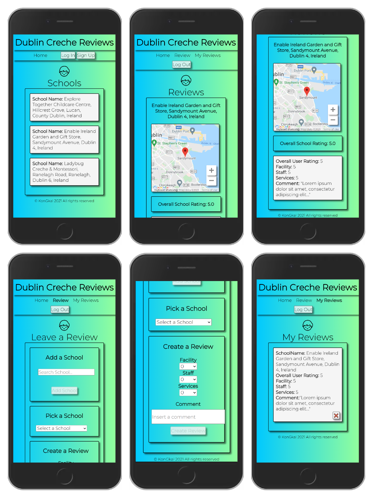

# Dublin Creche Reviews
Dublin Creche Reviews is a React Application that allows people to find or post reviews and information about a creche or a Montessori school in Dublin Ireland.

Finding a spot in a school in Dublin can be difficult, and since the Covid-19 crisis started this has only become more difficult because viewings can not take place anymore.
It is quite common for parents to exchange opinions about schools and to do that they have been using social media.

Dublin Creche Reviews is an app dedicated to helping parents form an opinion about a school based on real experiences that other people have had there.

# Getting Started 

## 1. Clone the Repo 
\
`git clone https://github.com/KonGkal/dublin-creche-reviews.git`

## 2. Install dependencies
\
  Navigate into the `./client` folder and run `npm install`
\
  Navigate into the `./server` folder and run `npm install`

## 3. Add Enviromental Variables 
\
  Within the folder there is an `example.env` file. Copy the variables from that file, paste them on a new `.env` file that you will create locally and fill the variables with     your local corresponding values. 
\
  Do the same for the `./server` holder.
\
## 4. Start the app
\
  Run the client by executing `npm run` from inside the client folder. 
  Run the server by executing `npm run` from inside the server folder.

# Tech stack

## Front-end
React
\
Axios
\
Auth0
\
Google Maps
\
Google Places Autocomplete Api
## Back-end
Express
\
PostgresSQL
\
Sequelize
\
Auth0
